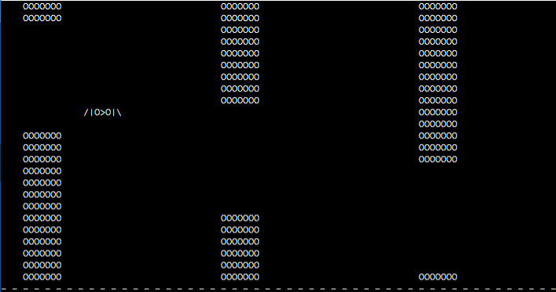

# Bird Game (C++)

Простая консольная игра про птицу на C++.

## Управление

- Пробел — прыжок
- Q — выход

## Что реализовано

- Движение птицы
- Обработка нажатий клавиш
- Игровой цикл
- Отрисовка в консоли

## Запуск

Требуется компилятор `g++` (C++11+).

```bash
g++ main.cpp -o bird
./bird
```

## Скриншот

